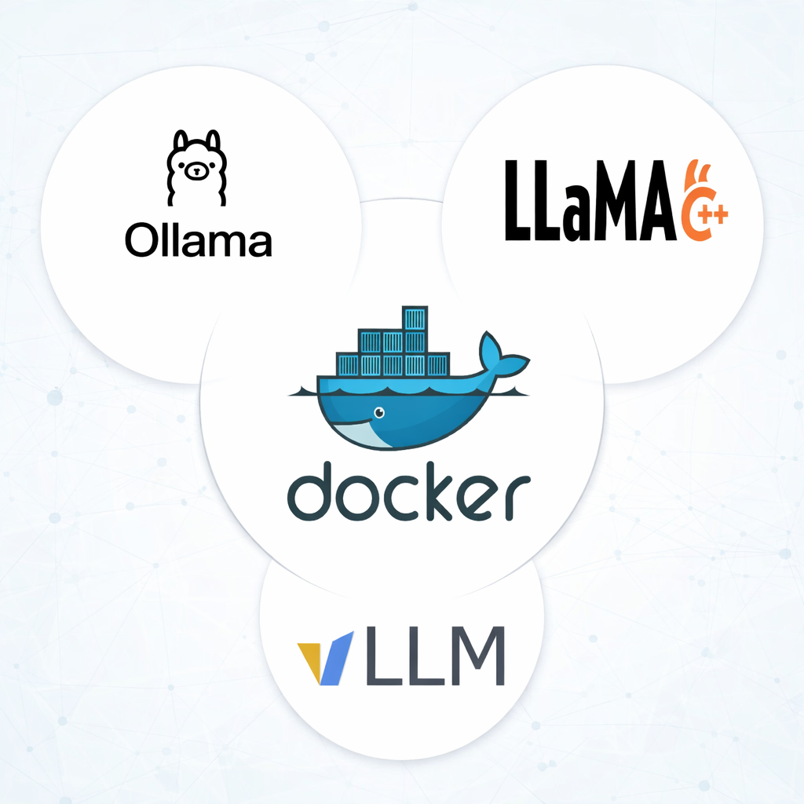

# LLM Engines

A comprehensive guide and setup for running Large Language Models using different inference engines: Ollama, llama.cpp, and vLLM. Each engine is containerized using Docker for easy deployment and testing.



## Table of Contents

- [Overview](#overview)
- [Prerequisites](#prerequisites)
- [Project Structure](#project-structure)
- [Configuration](#configuration)
- [Engines](#engines)
  - [Ollama](#ollama)
  - [llama.cpp](#llamacpp)
  - [vLLM](#vllm)
- [Testing](#testing)
- [Troubleshooting](#troubleshooting)

## Overview

This project provides Docker-based setups for three popular LLM inference engines:

- **Ollama**: User-friendly LLM runtime with simple model management
- **llama.cpp**: Efficient C++ implementation optimized for CPU and GPU inference
- **vLLM**: High-throughput serving engine optimized for production workloads

All engines expose OpenAI-compatible APIs, making it easy to switch between them.

## Prerequisites

- Docker and Docker Compose installed
- NVIDIA GPU with CUDA support (recommended)
- NVIDIA Container Toolkit installed
- Python 3.8+ (for testing scripts)
- Hugging Face account and token (for vLLM)

### Installing NVIDIA Container Toolkit

For GPU support, install the NVIDIA Container Toolkit:

```bash
# Ubuntu/Debian
distribution=$(. /etc/os-release;echo $ID$VERSION_ID)
curl -s -L https://nvidia.github.io/nvidia-docker/gpgkey | sudo apt-key add -
curl -s -L https://nvidia.github.io/nvidia-docker/$distribution/nvidia-docker.list | sudo tee /etc/apt/sources.list.d/nvidia-docker.list
sudo apt-get update && sudo apt-get install -y nvidia-container-toolkit
sudo systemctl restart docker
```

## Project Structure

```
LLM_Engines/
├── config.py                 # Centralized configuration for all engines
├── requirements.txt          # Python dependencies
├── ollama/
│   ├── docker-compose.yml   # Ollama service configuration
│   └── test_ollama.py       # Test script for Ollama
├── llama_cpp/
│   ├── docker-compose.yml   # llama.cpp service configuration
│   ├── docker/
│   │   └── Dockerfile       # Custom llama.cpp build
│   ├── models/              # Place GGUF models here
│   └── test_llama_cpp.py    # Test script for llama.cpp
└── vLLM/
    ├── docker-compose.yml   # vLLM service configuration
    └── test_vLLM.py         # Test script for vLLM
```

## Configuration

All engine configurations are centralized in `config.py`:

```python
OLLAMA_BASE_URL: str = "http://localhost:11435"
OLLAMA_MODEL: str = "llama3.2:1b"

VLLM_URL: str = "http://localhost:8018"
VLLM_MODEL: str = "casperhansen/llama-3.2-1b-instruct-awq"

LLAMA_CPP_URL: str = "http://localhost:8082"
LLAMA_CPP_MODEL: str = "Llama-3.2-1B-Instruct-Q4_0.gguf"
```

Modify these settings to use different models or ports.

## Engines

### Ollama

Ollama provides the simplest setup with automatic model management.

#### Setup

1. Navigate to the Ollama directory:
```bash
cd ollama
```

2. Start the service:
```bash
docker compose up -d
```

3. Pull a model:
```bash
docker exec -it model-ollama ollama pull llama3.2:1b
```

#### Configuration Options

Edit `ollama/docker-compose.yml` to customize:

- **OLLAMA_NUM_CTX**: Context window size (default: 10000)
- **OLLAMA_NUM_PARALLEL**: Number of parallel requests (default: 1)
- **OLLAMA_MAX_LOADED_MODELS**: Maximum models in memory (default: 1)
- **OLLAMA_FLASH_ATTENTION**: Enable flash attention (default: 1)
- **OLLAMA_NUM_GPU_LAYERS**: GPU layers to offload (default: 40)

#### GPU Configuration

To disable GPU support, remove the `deploy.resources.reservations.devices` section.

To use specific GPUs:
```yaml
devices:
  - driver: nvidia
    device_ids: ['0', '1']  # Use GPUs 0 and 1
    capabilities: [gpu]
```

#### Testing

```bash
cd ollama
python test_ollama.py
```

#### Stopping

```bash
docker compose down
```

### llama.cpp

llama.cpp offers efficient inference with extensive customization options.

#### Setup

1. Download a GGUF model and place it in `llama_cpp/models/`:
```bash
cd llama_cpp
mkdir -p models
# Download your GGUF model to models/
# Example: Llama-3.2-1B-Instruct-Q4_0.gguf
```

2. Build and start the service:
```bash
docker compose up --build -d
```

#### Configuration Options

Edit `llama_cpp/docker-compose.yml` to customize:

**Build Arguments:**
- **LLAMA_TAG**: llama.cpp release version (default: b7531)

**Runtime Parameters:**
- `-c 4096`: Context window size
- `-np 4`: Number of parallel sequences
- `-ngl 99`: GPU layers to offload
- `-fa on`: Enable flash attention
- `-b 2048`: Prompt batch size
- `-ub 1024`: Generation batch size
- `--cache-type-k q8_0`: Key cache quantization
- `--cache-type-v q8_0`: Value cache quantization
- `-t 8`: CPU threads
- `-n 4096`: Maximum tokens to generate

**Memory Limits:**
```yaml
limits:
  memory: "4G"  # Adjust based on your system
```

#### GPU Configuration

To use specific GPUs:
```yaml
devices:
  - driver: nvidia
    device_ids: ['0']  # Specify GPU ID
    capabilities: [gpu, compute, utility]
```

To disable GPU support, remove the `deploy.resources.reservations.devices` section and adjust `-ngl` to `0`.

#### Testing

```bash
cd llama_cpp
python test_llama_cpp.py
```

#### Stopping

```bash
docker compose down
```

### vLLM

vLLM provides high-throughput inference optimized for production workloads.

#### Setup

1. Set your Hugging Face token:
```bash
export HF_TOKEN=your_huggingface_token
```

Or create a `.env` file in the `vLLM` directory:
```
HF_TOKEN=your_huggingface_token
```

2. Start the service:
```bash
cd vLLM
docker compose up -d
```

You can get the token from [Hugging Face](https://huggingface.co/settings/tokens).

The model will be automatically downloaded from Hugging Face on first run.

#### Configuration Options

Edit `vLLM/docker-compose.yml` to customize:

**Model Configuration:**
- `--model`: Hugging Face model ID
- `--dtype auto`: Data type (auto, float16, bfloat16)
- `--quantization awq_marlin`: Quantization method

**Performance Tuning:**
- `--gpu-memory-utilization 0.7`: GPU memory usage (0.0-1.0)
- `--max-model-len 4096`: Maximum sequence length
- `--tensor-parallel-size 1`: Number of GPUs for tensor parallelism
- `--max-num-seqs 128`: Maximum concurrent sequences
- `--max-num-batched-tokens 4096`: Batch size in tokens

**Optimization:**
- `--enable-prefix-caching`: Enable KV cache reuse

**Shared Memory:**
```yaml
shm_size: '2gb'  # Increase for larger models
```

#### GPU Configuration

To use multiple GPUs:
```yaml
devices:
  - driver: nvidia
    count: 2  # Use 2 GPUs
    capabilities: [gpu]
```

Update `--tensor-parallel-size` accordingly.

#### Testing

```bash
cd vLLM
python test_vLLM.py
```

#### Stopping

```bash
docker compose down
```

## Testing

### Install Python Dependencies

```bash
pip install -r requirements.txt
```

### Running Tests

Each engine has a test script that sends a sample prompt and streams the response:

```bash
# Test Ollama
python ollama/test_ollama.py

# Test llama.cpp
python llama_cpp/test_llama_cpp.py

# Test vLLM
python vLLM/test_vLLM.py
```

All test scripts use the OpenAI Python client for consistent API interaction.

## Troubleshooting

### Container Health Checks

Check if services are healthy:

```bash
# Ollama
docker exec model-ollama ollama list

# llama.cpp
curl http://localhost:8082/health

# vLLM
curl http://localhost:8018/health
```

### View Logs

```bash
# Ollama
docker logs model-ollama

# llama.cpp
docker logs llm

# vLLM
docker logs model-vllm
```

### Common Issues

**GPU not detected:**
- Verify NVIDIA drivers: `nvidia-smi`
- Check Docker GPU access: `docker run --rm --gpus all nvidia/cuda:11.8.0-base-ubuntu22.04 nvidia-smi`

**Out of memory:**
- Reduce `gpu-memory-utilization` for vLLM
- Decrease context size or batch size
- Use smaller quantized models

**Model download fails (vLLM):**
- Verify HF_TOKEN is set correctly
- Check internet connection
- Ensure sufficient disk space

**Port already in use:**
- Change port mappings in docker-compose.yml
- Update corresponding URLs in config.py

### Performance Tips

1. **Use quantized models** for better memory efficiency
2. **Enable flash attention** when supported
3. **Adjust batch sizes** based on available VRAM
4. **Use tensor parallelism** (vLLM) for multi-GPU setups
5. **Monitor GPU utilization** with `nvidia-smi`

## License

This project is provided as-is for educational and development purposes.
